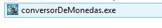

# Convertidor de Divisas en Java

Esta es una aplicación Java de consola que permite convertir cantidades de una moneda a otra utilizando tasas de cambio obtenidas de una API. La aplicación proporciona un menú interactivo para realizar conversiones de divisas, listar divisas disponibles y salir de la aplicación.

## Características

- **Conversión de Divisas**: Ingresa la cantidad, la divisa de origen y la divisa de destino para obtener el resultado de la conversión.
- **Listado de Divisas Disponibles**: Visualiza todas las divisas soportadas por la API.
- **Menú Interactivo**: Navega a través de las opciones usando ventanas emergentes de JOptionPane.

## Requisitos

- **Java 8** o superior.
- **Librerías Externas**:
  - `javax.swing.JOptionPane` para mostrar cuadros de diálogo en la interfaz de usuario.
  - API para tasas de cambio (opcional dependiendo del origen de datos).

## Uso

Al ejecutar el programa, se mostrará un menú con tres opciones:

1. **Convertir Divisa**: Solicita al usuario la cantidad y las divisas de origen y destino, y muestra el resultado de la conversión.
2. **Listar Divisas Disponibles**: Muestra una lista de las divisas soportadas.
3. **Salir**: Cierra la aplicación.

### Ejemplo de Conversión

1. Selecciona la opción **Convertir Divisa** en el menú.
2. Ingresa la cantidad a convertir, el código de la divisa de origen (por ejemplo, `USD`), y el código de la divisa de destino (por ejemplo, `COP`).
3. Obtendrás el monto equivalente en la divisa de destino.

### Estructura de Código

- **`ConversionObjeto`**: Clase que obtiene las tasas de cambio en un objeto JSON.
- **`ConvertidorDivisas`**: Clase que maneja las operaciones de conversión y listado de divisas.
- **`ConsultaConversorMonedas`**: Clase que consume el servicio para su uso. 
- **`Main`**: Clase principal con el menú de opciones.
